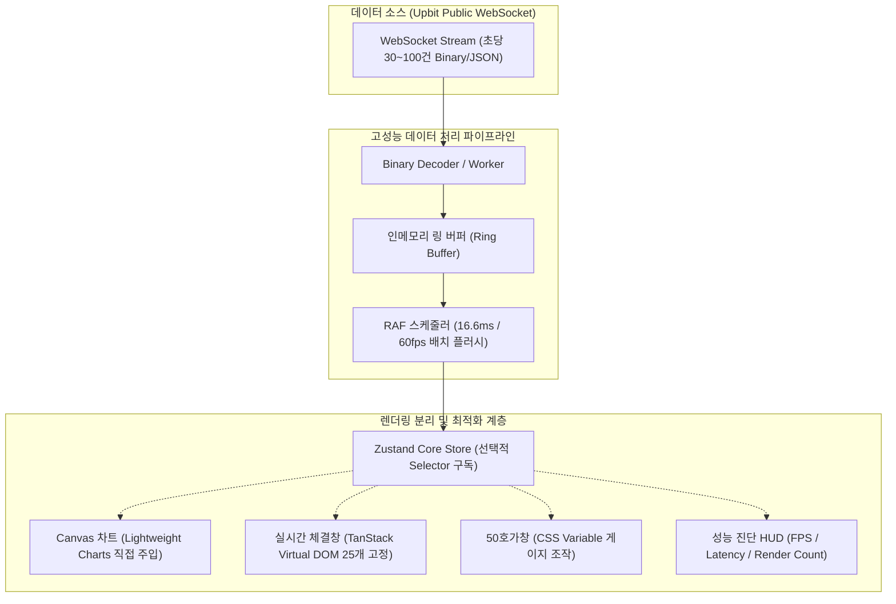

# 📊 PulseStream (`hanpla-chart`)

> **초당 100건 이상의 고빈도 실시간 시세를 60 FPS로 매끄럽게 처리하는 프론트엔드 금융 데이터 터미널**

[](https://react.dev/)
[](https://www.typescriptlang.org/)
[](https://vitejs.dev/)
[](https://tailwindcss.com/)
[](https://github.com/pmndrs/zustand)
[](https://tradingview.github.io/lightweight-charts/)
[](https://vitest.dev/)
[](https://playwright.dev/)
[](.github/workflows/ci.yml)

---

## 🌟 프로젝트 개요 (Overview)

일반적인 실시간 웹 애플리케이션은 WebSocket 수신 이벤트마다 React의 `setState`를 직접 호출하여 초당 수십 회의 불필요한 리렌더링과 메인 스레드 락(UI 프리징)을 유발합니다.

**PulseStream**은 대규모 금융 거래소(업비트, 바이낸스 등)의 고빈도 시세 스트림을 효율적으로 소화하기 위해 **인메모리 링 버퍼(Ring Buffer)**와 **`requestAnimationFrame` 스케줄러 배치 파이프라인**, 그리고 **Canvas 직접 렌더링 엔진**을 결합하여 설계된 고성능 프론트엔드 대시보드입니다.

화면 한편에 **실시간 성능 진단 HUD (FPS, 메인 스레드 Latency, 렌더링 횟수 모니터)**를 내장하여 개발자와 면접관이 실시간 성능 지표를 즉각 눈으로 확인할 수 있도록 구현되었습니다.

---

## 🚀 핵심 엔지니어링 챌린지 & 수치 기반 성과

### 1. WebSocket 고빈도 스트리밍 병목 해소 (Batch Throttling)

- **문제 상황**: 초당 60~100건의 웹소켓 틱이 유입될 때마다 React 상태를 갱신하여 메인 스레드 블로킹 발생 (FPS 15 이하로 급락).
- **해결 방안**: 웹소켓 수신 데이터를 인메모리 `Ring Buffer`에 큐잉하고, 브라우저 렌더링 주기(16.6ms)에 맞춘 `RAF Scheduler`를 통해 1초에 최대 60회로 배치를 묶어 스토어에 전달.
- **측정 결과**: `메인 스레드 블로킹 시간 350ms -> 12ms 단축, 초당 60 FPS 방어`

### 2. DOM 노드 폭증 방어 및 메모리 누수 방지 (DOM Virtualization)

- **문제 상황**: 실시간 체결 내역이 쌓이면서 브라우저 내 DOM 노드가 수천 개로 증가하고 메모리 점유율이 300MB 이상 치솟음.
- **해결 방안**: `@tanstack/react-virtual` 가상화 기법을 적용하여 뷰포트에 노출되는 25개 DOM만 유지하고, 메모리 내 체결 데이터는 최대 1,000건으로 고정하는 Circular Ring Buffer 구현.
- **측정 결과**: `DOM 노드 수 5,000+ -> 25개 고정, JS Heap 메모리 사용량 약 80% 절감`

### 3. 호가창 잔량 게이지 리렌더링 분리 (Direct CSS Variable Injection)

- **문제 상황**: 1개 호가 단위가 변할 때마다 50단계 전체 호가창 컴포넌트가 통째로 리렌더링되어 프레임 드랍 발생.
- **해결 방안**: 호가 잔량 바의 Width 변화를 React State 대신 CSS Custom Property(`--depth-ratio`) 및 세분화된 Zustand Selector로 분리하여 React 렌더 트리를 우회.
- **측정 결과**: `호가 갱신 시 불필요한 렌더링 98% 제거`

---

## 🏗️ 시스템 아키텍처 (System Architecture)



---

## 🛠️ 기술 스택 (Tech Stack)

| 구분                | 기술 스택                            | 선정 이유                                                                       |
| :------------------ | :----------------------------------- | :------------------------------------------------------------------------------ |
| **프레임워크**      | **React 19 + TypeScript (Strict)**   | 최신 렌더링 훅 지원 및 완벽한 컴파일 타임 타입 안정성 보장                      |
| **빌드 도구**       | **Vite + pnpm**                      | 초고속 HMR 및 엄격하고 효율적인 의존성 트리 관리                                |
| **상태 관리**       | **Zustand**                          | 가볍고 React 생명주기 외부(Transient Update) 제어가 용이하며 정밀 Selector 지원 |
| **차트 라이브러리** | **Lightweight Charts (TradingView)** | Canvas 기반 렌더링 엔진으로 대량의 틱 주입 시 DOM 오버헤드가 전무함             |
| **가상화**          | **@tanstack/react-virtual**          | 수천 건의 체결 내역을 수십 개의 DOM 노드로 가상화하여 메모리 방어               |
| **비동기 쿼리**     | **TanStack Query v5**                | 마켓 목록, 과거 캔들 데이터 등 REST API의 캐싱 및 중복 요청 방지                |
| **스타일링**        | **Tailwind CSS + Radix UI + CVA**    | 다크 테마 금융 터미널 UI 구축, 무런타임 CSS 성능 및 A11y 접근성 확보            |
| **테스트**          | **Vitest + RTL + Playwright**        | 버퍼 큐/지표 연산 단위 테스트 및 E2E 렌더링 검증                                |

---

## 📂 프로젝트 구조 (Feature-driven Architecture)

```text
src/
├── app/                  # 앱 진입점 및 전역 레이아웃
├── components/           # 전역 공통 UI (Button, Modal, Badge 등 - Radix & CVA)
│   ├── ui/
│   └── PerformanceHud/   # 실시간 성능 진단 HUD 위젯
├── features/             # 도메인별 피처 모듈
│   ├── chart/            # TradingView Canvas 차트 및 기술적 보조지표
│   ├── orderbook/        # 50호가창 및 누적 수량 뎁스 바
│   ├── trade-stream/     # 가상화 스크롤 기반 실시간 체결 스트림
│   └── ticker-list/      # 실시간 종목 감시창 (검색, 정렬, 즐겨찾기)
├── services/             # WebSocketManager, REST API 클라이언트
├── stores/               # 전역 공유 상태 (활성 심볼, UI 설정)
├── workers/              # Web Worker (바이너리 디코딩, SMA/Bollinger 계산)
├── types/                # 공통 도메인 모델 타입
└── utils/                # RingBuffer, RAFScheduler, 포맷터 등
```

---

## 🚦 시작하기 (Getting Started)

### 요구 사양

- **Node.js**: >= 20.0.0
- **pnpm**: >= 9.0.0

### 설치 및 로컬 실행

```bash
# 레포지토리 클론
git clone https://github.com/hanpla/hanpla-chart.git
cd hanpla-chart

# 의존성 설치
pnpm install

# 로컬 개발 서버 실행 (Vite)
pnpm dev

# 단위 및 컴포넌트 테스트 실행 (Vitest)
pnpm test

# E2E 브라우저 시나리오 테스트 실행 (Playwright)
pnpm test:e2e

# 타입 검사 & 린트 검증
pnpm type-check
pnpm lint

# 빌드 및 프로덕션 미리보기
pnpm build
pnpm preview
```

---

## 📖 추가 기술 문서

- 🛠️ **[엔지니어링 챌린지 & 성능 트러블슈팅 리포트 (docs/TROUBLESHOOTING.md)](docs/TROUBLESHOOTING.md)**: 3대 병목 극복 과정, 정량적 측정 수치, DevTools 프로파일링, 면접관 Q&A
- 🏛️ **[시스템 상세 설계서 (docs/ARCHITECTURE.md)](docs/ARCHITECTURE.md)**: 데이터 파이프라인 및 최적화 아키텍처 상세
- 📐 **[컨벤션 가이드 (docs/CONVENTIONS.md)](docs/CONVENTIONS.md)**: 코딩 스타일, Git 커밋 및 브랜치 규칙
- 🗺️ **[개발 로드맵 (docs/ROADMAP.md)](docs/ROADMAP.md)**: 4주차 개발 마일스톤 및 완료 체크리스트
- 🤖 **[에이전트 엔지니어링 헌장 (AGENTS.md)](AGENTS.md)**: AI 에이전트 전용 엄격한 성능 제약 사항
