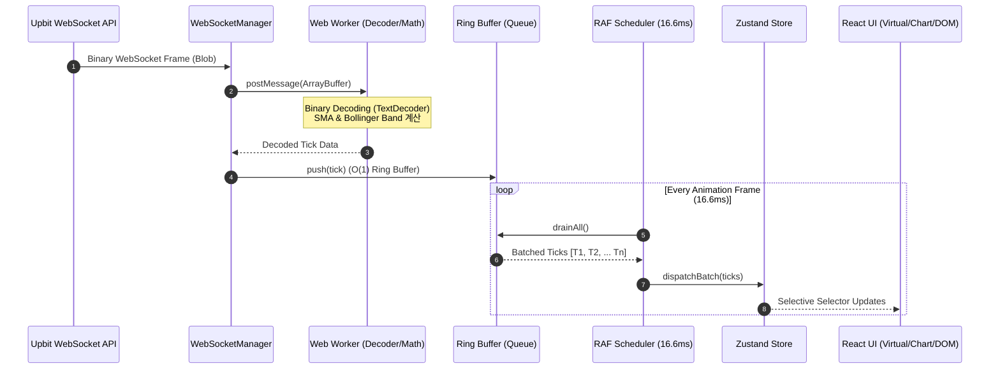

# 🏛️ PulseStream 시스템 아키텍처 상세 설계서

본 문서는 **PulseStream (`hanpla-chart`)**의 데이터 수신 파이프라인, 상태 전파 흐름, 렌더링 최적화 전략 및 안정성 보장 설계를 기술합니다.

---

## 1. 아키텍처 개요 및 설계 철학

금융 거래소 환경은 초당 50~200건 이상의 시세 및 체결 이벤트가 끊임없이 브라우저로 쏟아집니다. React의 표준적인 렌더링 패러다임(`State 갱신 -> Virtual DOM Diffing -> DOM Commit`)을 고빈도 스트림에 그대로 적용할 경우, 브라우저 메인 스레드가 렌더링 락에 걸려 화면 멈춤 현상(Jank)이 발생합니다.

PulseStream은 다음 3가지 핵심 철학으로 시스템을 설계했습니다:

1. **메인 스레드 보호 (Isolate Main Thread)**: 원시 바이트 디코딩과 보조지표 수학 연산은 Web Worker로 분리한다.
2. **배치 기반 프레임 동기화 (Frame-Synchronized Batching)**: 유입 빈도에 종속되지 않고, 디스플레이 주사율(60Hz, 16.6ms)에 맞춰 데이터를 배치 플러시(Flush)한다.
3. **선택적 렌더링 분리 (Selective Subscriptions & Direct DOM)**: 빈번히 변하는 컴포넌트(호가창 게이지, 차트 틱)는 React 가상 DOM 연산을 우회하거나 미세하게 격리한다.

---

## 2. 고빈도 데이터 처리 파이프라인 (Data Pipeline)



### 2.1 WebSocketManager (연결 및 복구)

- **단일 연결 멀티플렉싱**: 단일 웹소켓 커넥션을 통해 현재 활성화된 마켓(`KRW-BTC` 등)의 Ticker, OrderBook, Trade Stream을 동시 구독.
- **지수 백오프(Exponential Backoff) 재연결**:
  - 네트워크 순단 시 `Math.min(1000 * Math.pow(2, attempt), 30000)` 공식에 따라 재연결 시도 (지터 적용).
- **Heartbeat Ping-Pong**: 브라우저 탭 비활성화 후 복귀 시 침묵 연결(Ghost Connection)을 감지하고 강제 재연결.

### 2.2 인메모리 링 버퍼 (Ring Buffer)

- 일반 JavaScript 배열을 `push()`/`shift()`할 경우 $O(N)$의 메모리 복사 및 GC 압력이 발생합니다.
- 고정 크기(Fixed Capacity: 2,048)의 **Circular Ring Buffer**를 구현하여 포인터 연산 기반 $O(1)$ 삽입/추출을 보장합니다.
- 버퍼 풀링(Pooling)을 통해 객체 할당을 재사용하여 가비지 컬렉터 스파이크를 방지합니다.

### 2.3 RAF (requestAnimationFrame) 스케줄러

- 웹소켓에서 초당 100건이 유입되더라도, 디스플레이가 표현할 수 있는 최대 한계는 60fps(16.6ms당 1프레임)입니다.
- `requestAnimationFrame` 루프를 구동하여 16.6ms 동안 링 버퍼에 모인 틱 데이터들을 1회의 배치(Batch)로 압축하여 스토어에 전달합니다.

---

## 3. 컴포넌트별 렌더링 최적화 전략

| 컴포넌트                                    | 최적화 기법                                                    | 달성 목표                                                  |
| :------------------------------------------ | :------------------------------------------------------------- | :--------------------------------------------------------- |
| **캔들 차트 (`features/chart`)**            | TradingView `lightweight-charts` Canvas 직접 렌더링            | React 가상 DOM 거치지 않고 Canvas API로 초당 60fps 틱 반영 |
| **실시간 체결창 (`features/trade-stream`)** | `@tanstack/react-virtual` 가상 스크롤 (1,000건 유지, DOM 25개) | 메모리 누수 방지 및 스크롤 시 60fps 유지                   |
| **50호가창 (`features/orderbook`)**         | CSS Custom Property (`--depth-ratio`) 및 Row 단위 `React.memo` | 잔량 변동 시 50개 행 전체 리렌더링 원천 차단               |
| **종목 감시창 (`features/ticker-list`)**    | 가상화 리스트 + 로컬 검색/정렬 인덱싱                          | 100개 이상 코인 데이터 갱신 시 DOM 30개 미만 유지          |

### 3.1 호가창(OrderBook) 렌더링 분리 상세

호가창은 매 틱마다 50개 호가 레벨의 잔량이 미세하게 흔들립니다.

1. **React.memo 분리**: 각 호가 Row 컴포넌트는 `price`와 `type`이 일치할 때만 얕은 비교 수행.
2. **CSS Variable Depth Bar**:
   - 잔량 게이지 바의 너비를 `style={{ width: `${ratio}%` }}`로 React State에서 주입하지 않고,
   - CSS Custom Property `--depth-percent`로 컴포넌트 루트에 주입하여 브라우저 컴포지터(Compositor) 스레드에서 GPU 가속 렌더링을 유도합니다.

```tsx
// 호가창 잔량 바 최적화 패턴 예시
<div
  className="relative h-6 flex items-center justify-between px-2"
  style={{ "--depth-ratio": `${depthRatio}%` } as React.CSSProperties}
>
  <div
    className="absolute right-0 top-0 bottom-0 bg-emerald-500/10 pointer-events-none transition-all duration-75"
    style={{ width: "var(--depth-ratio)" }}
  />
  <span className="z-10 font-mono text-xs">{formattedPrice}</span>
  <span className="z-10 font-mono text-xs text-muted-foreground">
    {quantity}
  </span>
</div>
```

---

## 4. 실시간 성능 모니터링 HUD (Performance HUD)

PulseStream은 엔지니어링 역량을 시각적으로 증명하기 위해 자체 성능 진단 HUD를 탑재합니다:

- **FPS 카운터**: `requestAnimationFrame` 타임스탬프 델타 기반 실시간 초당 프레임 수 측정 (녹색: 55~60fps, 황색: 40~54fps, 적색: <40fps)
- **Main Thread Latency**: 마이크로태스크 지연 시간 측정 (메인 스레드 블로킹 여부 진단)
- **Tick Throughput**: 초당 수신 및 처리된 웹소켓 틱 건수 (TPS: Ticks Per Second)
- **DOM Node Count**: 현재 화면에 마운트된 DOM 엘리먼트 총합 (`document.getElementsByTagName('*').length`)
- **Heap Memory**: `window.performance.memory` API를 통한 JS Heap 점유량 실시간 트래킹 (Chrome 환경 지원)

---

## 5. 결함 격리 및 복원력 (Fault Tolerance)

1. **React Error Boundaries**: 차트 엔진이나 Web Worker에서 예외가 발생하더라도 대시보드 전체가 화이트아웃되지 않도록 각 피처별 독립 에러 바운더리 배치.
2. **REST Fallback**: 웹소켓 연결 지연 또는 차단 시 TanStack Query를 통해 5초 주기의 REST Polling 모드로 매끄럽게 전환.
3. **Rate-Limiting 방어**: 초당 과도한 마켓 변경 요청이 발생할 경우 디바운스를 적용하여 거래소 API IP 밴(Ban) 방지.
